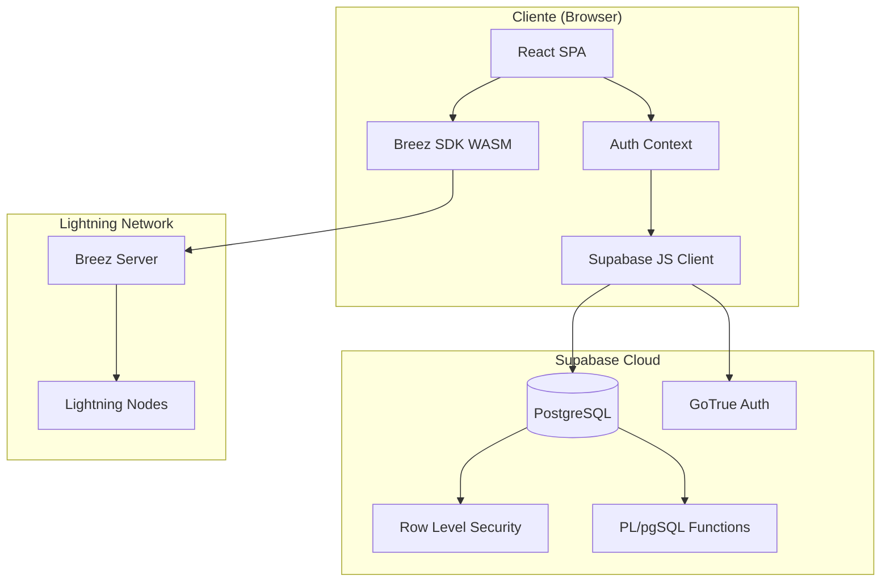
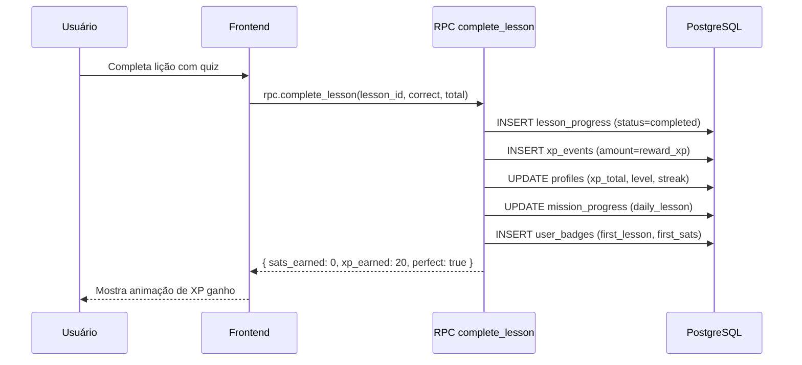
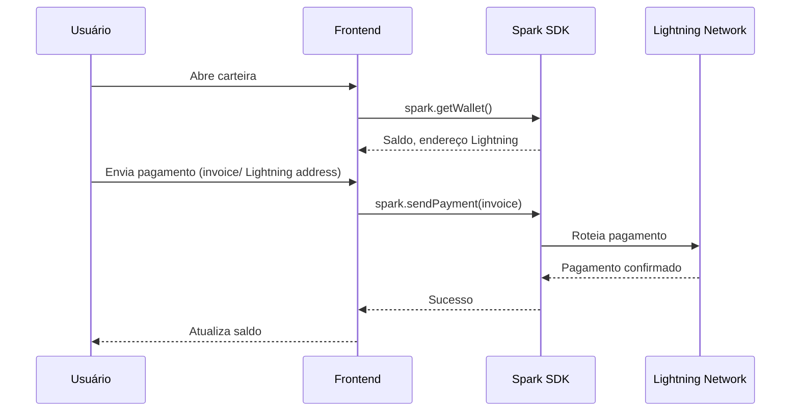
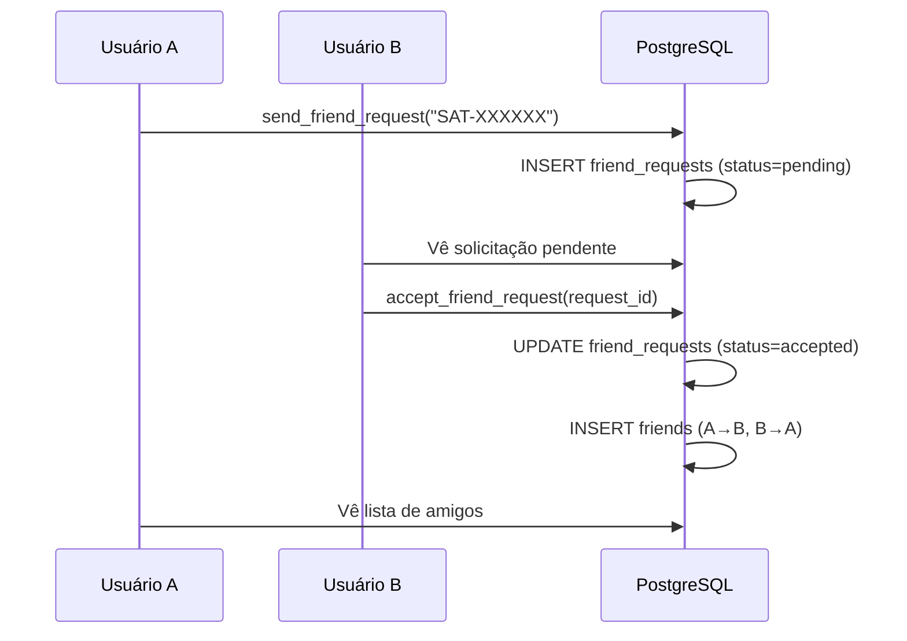

# Arquitetura

## Visão geral

SATQUEST é uma aplicação **single-page** (SPA) construída com React + Vite,
usando Supabase como backend (PostgreSQL + Auth + RPC) e Breez SDK Spark para
integração com a Lightning Network.

## Camadas

### 1. Frontend (React 19 + Vite 6)

- **Screens**: páginas da aplicação (`Home`, `Wallet`, `Profile`, etc.)
- **Components/UI**: componentes reutilizáveis (`Button`, `Card`, `Input`)
- **Lib**: lógica de negócio, hooks, clientes de API
- **Auth Context**: gerencia sessão e perfil do usuário

### 2. Backend (Supabase)

- **PostgreSQL**: banco de dados relacional com RLS
- **Auth**: autenticação email/senha via GoTrue
- **RPC**: funções PL/pgSQL `SECURITY DEFINER` para operações atômicas
- **Triggers**: auto-provisioning de novos usuários

### 3. Bitcoin (Breez SDK Spark)

- **WASM**: SDK compilado para WebAssembly, roda no browser
- **Non-custodial**: as chaves privadas ficam no dispositivo do usuário
- **Lightning**: pagamentos instantâneos via rede Lightning

## Fluxos principais

### Fluxo de XP

### Fluxo de carteira

### Fluxo de amigos

## Decisões arquiteturais

### Por que RPC em vez de CRUD direto?

Operações financeiras (creditar XP, completar lição, resgatar missão) precisam
ser **atômicas** — ou tudo acontece, ou nada. Usar funções `SECURITY DEFINER`
garante que:

1. A operação é transacional
2. O cliente não pode manipular o saldo diretamente
3. Audit logs são registrados automaticamente
4. Rate limits e cooldowns são aplicados no servidor

### Por que RLS em todas as tabelas?

Mesmo com RPC para operações sensíveis, o RLS garante que:

- Um usuário nunca lê dados de outro (exceto perfis, que são públicos)
- Mesmo que um bug no frontend envie uma query errada, o banco bloqueia
- Defense-in-depth: múltiplas camadas de segurança

### Por que Breez SDK Spark?

- **Non-custodial**: o aluno tem controle das chaves
- **WASM**: roda no browser sem backend adicional
- **Lightning**: pagamentos instantâneos e baratos
- **Open source**: mantido pela Breez Technology

## Padrões de código

- **TypeScript strict**: sem `any`, tipos explícitos em todas as funções
- **CSS variables**: theming via custom properties, sem cores hardcoded
- **8px spacing**: grid de espaçamento consistente
- **Functional components**: sem classes, apenas hooks
- **Import discipline**: todo símbolo usado deve ter import correspondente
