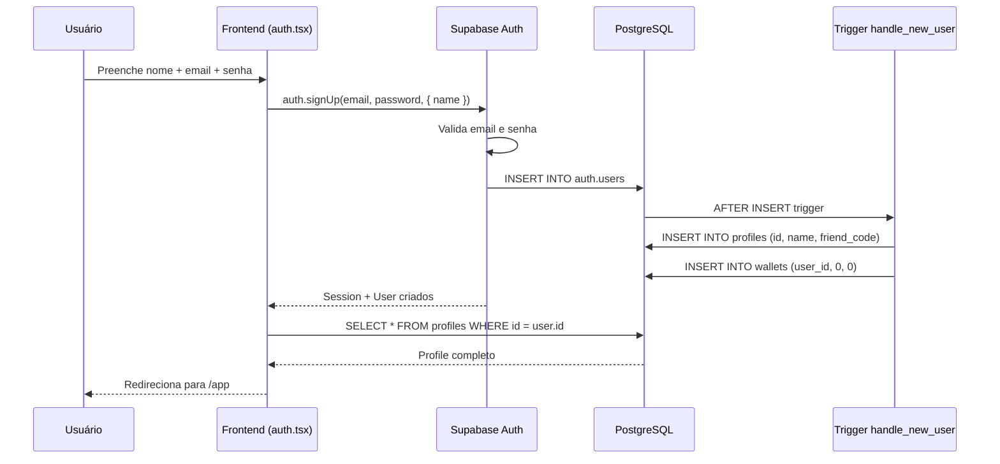
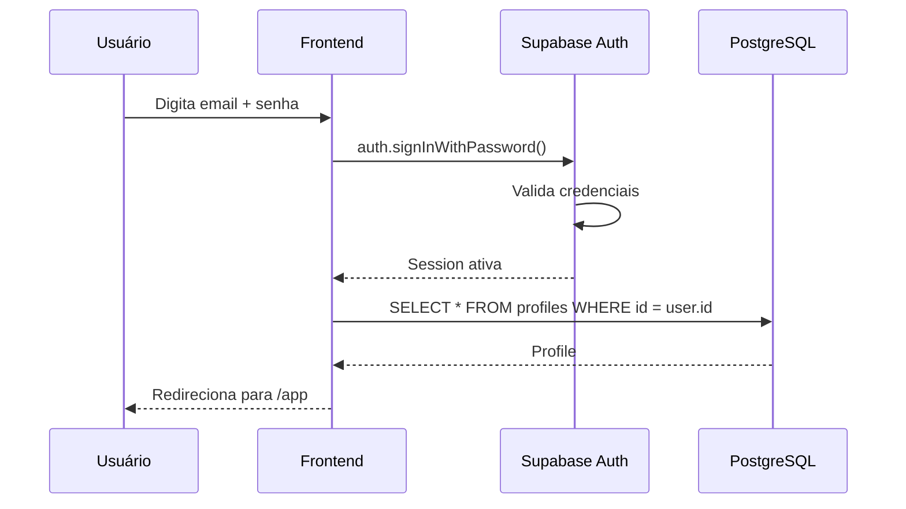

# Autenticação

## Visão geral

SATQUEST usa **Supabase Auth** (GoTrue) com email e senha. Não há confirmação
de email (modo de desenvolvimento/hackathon). O perfil e a carteira são criados
automaticamente via trigger quando um novo usuário se registra.

## Fluxo de cadastro



### Pontos críticos

1. **O trigger faz tudo**: O frontend NÃO faz upsert manual de profile. Isso
   causava uma race condition com RLS (a sessão ainda não estava ativa quando
   o upsert era tentado, então `auth.uid()` retornava NULL e a policy
   `insert_own_profile` bloqueava).

2. **Espera de 500ms**: Após o `signUp`, o frontend espera 500ms antes de
   carregar o profile, dando tempo para o trigger completar.

3. **Email confirmation OFF**: Em modo hackathon, a confirmação de email está
   desativada. O usuário pode logar imediatamente após o cadastro.

## Fluxo de login



## Gerenciamento de sessão

O `AuthProvider` em `src/lib/auth.tsx` gerencia a sessão:

```typescript
// Estado disponível via useAuth()
const {
  session,    // Session | null
  user,        // User | null
  profile,     // Profile | null
  loading,     // boolean
  signUp,      // (email, password, name) => Promise<{ error }>
  signIn,      // (email, password) => Promise<{ error }>
  signOut,     // () => Promise<void>
  refreshProfile, // () => Promise<void>
} = useAuth();
```

### `onAuthStateChange`

O provider escuta mudanças de estado de auth e carrega o profile automaticamente:

```typescript
supabase.auth.onAuthStateChange((_event, newSession) => {
  setSession(newSession);
  if (newSession?.user) {
    loadProfile(newSession.user.id);
  } else {
    setProfile(null);
  }
});
```

## Proteção de rotas

```typescript
// RequireAuth: redireciona para /entrar se não logado
function RequireAuth({ children }) {
  const { session, loading } = useAuth();
  if (loading) return <Splash />;
  if (!session) return <Navigate to="/entrar" />;
  return children;
}

// PublicOnly: redireciona para /app se já logado
function PublicOnly({ children }) {
  const { session, loading } = useAuth();
  if (loading) return <Splash />;
  if (session) return <Navigate to="/app" />;
  return children;
}
```

## RLS e Auth

Todas as policies usam `auth.uid()` para verificar identidade:

```sql
-- Owner-scoped: só o próprio usuário
USING (auth.uid() = user_id)

-- Profile: SELECT público, UPDATE/INSERT owner
USING (true) -- SELECT
USING (auth.uid() = id) -- UPDATE
```

O role `anon` tem **zero privilégios** (revogado na migração 0007). Apenas
`authenticated` pode acessar tabelas e funções RPC.

## Tratamento de erros

```typescript
function mapAuthError(msg: string): string {
  if (msg.includes("already registered"))
    return "Esse e-mail já tem conta. Tenta entrar.";
  if (msg.includes("invalid credentials"))
    return "E-mail ou senha errados. Confere e tenta de novo.";
  if (msg.includes("rate limit"))
    return "Muitas tentativas. Espera uns minutos e tenta de novo.";
  if (msg.includes("network"))
    return "Sem internet agora. Confere tua conexão.";
  return "Algo deu errado. Tenta de novo.";
}
```

## Futuro: OAuth social

A estrutura está pronta para adicionar Google e GitHub OAuth no futuro:

```typescript
// Exemplo futuro (não implementado ainda)
const { data, error } = await supabase.auth.signInWithOAuth({
  provider: "google",
  options: { redirectTo: window.location.origin + "/app" },
});
```

O trigger `handle_new_user` já lida com qualquer método de cadastro, pois
extrai o nome de `raw_user_meta_data` e usa `COALESCE` para não sobrescrever.
