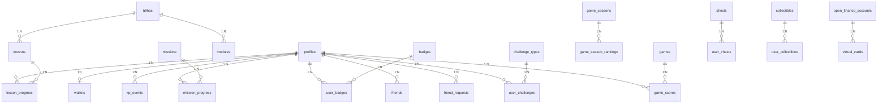

# Banco de Dados

## Visão geral

O banco é um PostgreSQL gerenciado pelo Supabase, com **Row Level Security
(RLS)** habilitado em todas as tabelas e funções RPC `SECURITY DEFINER` para
operações atômicas.

## Diagrama ER



## Tabelas

### Conteúdo (leitura pública para authenticated)

| Tabela | Descrição | RLS SELECT |
|--------|-----------|-----------|
| `trilhas` | Trilhas de aprendizado | `is_published = true` |
| `lessons` | Lições dentro de trilhas | `is_published = true` |
| `missions` | Missões diárias | `is_active = true` |
| `badges` | Conquistas (35+) | `true` |
| `modules` | Módulos educacionais | `is_published = true` |
| `games` | Jogos do Game Center | `is_active = true` |
| `game_seasons` | Temporadas | `true` |
| `chests` | Baús com recompensas | `is_active = true` |
| `collectibles` | Skins, avatares, títulos | `true` |
| `leagues` | Ligas (Bronze→Lenda) | `true` |
| `challenge_types` | Tipos de desafio (20) | `is_active = true` |

### Dados do usuário (owner-scoped)

| Tabela | Descrição | RLS |
|--------|-----------|-----|
| `profiles` | Perfil do usuário | SELECT público, UPDATE/INSERT owner |
| `wallets` | Carteira (1 por usuário) | SELECT owner, INSERT owner |
| `wallet_txs` | Transações da carteira | SELECT owner, INSERT owner |
| `lesson_progress` | Progresso por lição | CRUD owner |
| `xp_events` | Log de XP | SELECT/INSERT owner |
| `mission_progress` | Progresso de missão | SELECT/INSERT/UPDATE owner |
| `user_badges` | Badges desbloqueados | SELECT/INSERT owner |
| `game_scores` | Scores de jogos | SELECT/INSERT owner |
| `game_season_rankings` | Ranking semanal | SELECT all, INSERT/UPDATE owner |
| `module_progress` | Progresso por módulo | CRUD owner |
| `user_chests` | Baús abertos | SELECT/INSERT owner |
| `user_collectibles` | Colecionáveis | SELECT/INSERT/UPDATE owner |
| `open_finance_accounts` | Conta Open Finance | CRUD owner |
| `virtual_cards` | Cartões virtuais | CRUD owner |
| `friends` | Amizades | SELECT both parties, INSERT/DELETE owner |
| `friend_requests` | Solicitações de amizade | SELECT/INSERT/UPDATE/DELETE owner |
| `streak_freezes` | Congelamento de streak | SELECT/INSERT owner |
| `user_challenges` | Desafios do usuário | SELECT/INSERT/UPDATE owner |
| `invites` | Convites | SELECT/INSERT/UPDATE owner |
| `audit_logs` | Logs de auditoria | SELECT owner |

## Triggers

| Trigger | Tabela | Função | Descrição |
|---------|--------|--------|-----------|
| `on_auth_user_created` | `auth.users` | `handle_new_user()` | Cria profile + wallet + friend_code |
| `trg_profiles_updated_at` | `profiles` | `set_updated_at()` | Atualiza `updated_at` |
| `trg_lesson_progress_updated_at` | `lesson_progress` | `set_updated_at()` | Atualiza `updated_at` |
| `trg_wallets_updated_at` | `wallets` | `set_updated_at()` | Atualiza `updated_at` |
| `trg_mission_progress_updated_at` | `mission_progress` | `set_updated_at()` | Atualiza `updated_at` |
| `trg_friend_requests_updated_at` | `friend_requests` | `set_updated_at()` | Atualiza `updated_at` |
| `trg_user_challenges_updated_at` | `user_challenges` | `set_updated_at()` | Atualiza `updated_at` |

## Funções RPC

| Função | Descrição | Segurança |
|--------|-----------|-----------|
| `complete_lesson(lesson_id, quiz_correct, quiz_total)` | Completa lição, credita XP, atualiza streak/level/missões/badges | SECURITY DEFINER |
| `claim_mission(mission_progress_id)` | Resgata recompensa de missão (XP) | SECURITY DEFINER |
| `record_game_score(game_id, score)` | Registra score de jogo, atualiza ranking | SECURITY DEFINER |
| `verify_age_and_enable_open_finance()` | Verifica idade e habilita Open Finance | SECURITY DEFINER |
| `create_virtual_card()` | Cria cartão virtual (age-gated) | SECURITY DEFINER |
| `generate_referral_code()` | Gera código de convite único | SECURITY DEFINER |
| `get_referral_stats()` | Estatísticas de convites | SECURITY INVOKER |
| `update_profile(...)` | Atualiza perfil (campos básicos) | SECURITY INVOKER |
| `update_profile_extended(...)` | Atualiza perfil (todos os campos) | SECURITY INVOKER |
| `send_friend_request(friend_code)` | Envia solicitação de amizade | SECURITY DEFINER |
| `accept_friend_request(request_id)` | Aceita solicitação | SECURITY DEFINER |
| `reject_friend_request(request_id)` | Rejeita solicitação | SECURITY DEFINER |
| `delete_account()` | Exclui conta e todos os dados | SECURITY DEFINER |

## RLS — Padrões

### Owner-scoped (maioria das tabelas)

```sql
CREATE POLICY "select_own_X" ON X FOR SELECT
  TO authenticated USING (auth.uid() = user_id);

CREATE POLICY "insert_own_X" ON X FOR INSERT
  TO authenticated WITH CHECK (auth.uid() = user_id);

CREATE POLICY "update_own_X" ON X FOR UPDATE
  TO authenticated USING (auth.uid() = user_id) WITH CHECK (auth.uid() = user_id);

CREATE POLICY "delete_own_X" ON X FOR DELETE
  TO authenticated USING (auth.uid() = user_id);
```

### Conteúdo público (apenas SELECT)

```sql
CREATE POLICY "read_published_X" ON X FOR SELECT
  TO authenticated USING (is_published = true);
```

### Perfil (SELECT público, UPDATE owner)

```sql
CREATE POLICY "select_all_profiles" ON profiles FOR SELECT
  TO authenticated USING (true);

CREATE POLICY "update_own_profile" ON profiles FOR UPDATE
  TO authenticated USING (auth.uid() = id) WITH CHECK (auth.uid() = id);
```

## Migrações

| # | Arquivo | Descrição |
|---|---------|-----------|
| 0001 | `initial_schema` | Schema base: trilhas, lições, progresso, carteira, missões, badges |
| 0002 | `seed_content` | Seed de trilhas e lições |
| 0003 | `v2_evolution` | Game Center, Open Finance, coleccionáveis, módulos |
| 0004 | `seed_v2_content` | Seed de jogos, módulos, baús |
| 0005 | `security_and_rpc` | Funções RPC atômicas, search_path fix |
| 0006 | `security_hardening_v4` | Audit logs, rate limits, cooldowns, EXECUTE hardening |
| 0007 | `revoke_anon_privileges` | Revoga todos os privilégios do role anon |
| 0008 | `xp_only_rewards` | Lições/jogos/missões recompensam apenas XP |
| 0009 | `fix_signup_auto_provisioning` | Auto-provisioning completo + amigos + ligas + desafios |
