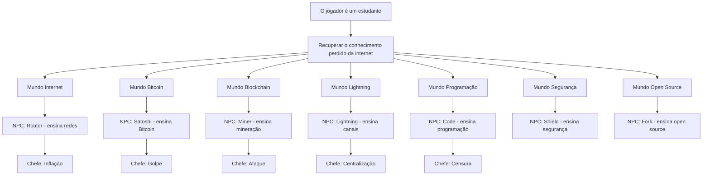
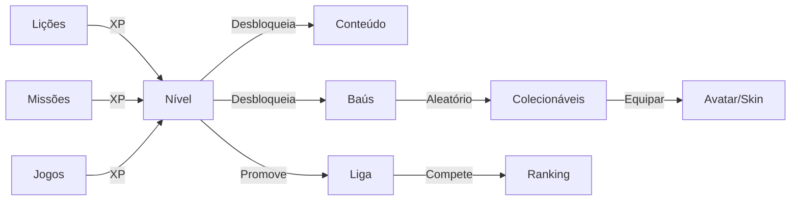

# Game Design

## Filosofia

SATQUEST não é um site educativo. É um jogo AAA educacional. Cada decisão de
design deve aumentar:

- **Engajamento** — o aluno quer voltar amanhã
- **Aprendizagem** — o aluno aprende algo real, não decora
- **Retenção** — o aluno não desiste no primeiro desafio
- **Curiosidade** — o aluno quer explorar o próximo mundo
- **Autonomia** — o aluno ganha confiança para agir sozinho

## Narrativa



### História

O jogador é um estudante que descobre que a internet está perdendo seu
conhecimento original. Conceitos como liberdade financeira, criptografia e
descentralização estão sendo esquecidos. Para recuperar esse conhecimento,
o jogador deve viajar por diferentes mundos, cada um ensinando um conceito
fundamental.

### NPCs

Cada mundo tem um NPC (Non-Player Character) que guia o aluno:

| Mundo | NPC | Ensina |
|-------|-----|--------|
| Internet | Router 📡 | Como a internet funciona, TCP/IP, DNS |
| Bitcoin | Satoshi 🟧 | Dinheiro, inflação, escassez |
| Blockchain | Miner ⛏️ | Blocos, hash, proof of work |
| Lightning | Spark ⚡ | Canais, roteamento, taxas |
| Programação | Code 💻 | Lógica, algoritmos, sintaxe |
| Segurança | Shield 🛡️ | Phishing, golpes, privacidade |
| Open Source | Fork 🍴 | Git, colaboração, comunidade |

### Chefes

Cada mundo termina com um chefe que representa um problema real:

| Chefe | Problema | Mecânica |
|-------|----------|----------|
| Inflação 📈 | Impressão de dinheiro | Simulador de economia |
| Golpe 🚨 | Phishing e scam | Detecção de phishing |
| Ataque 💀 | 51% attack | Validar blockchain |
| Centralização 🏛️ | Banco único | Comparar sistemas |
| Censura 🚫 | Conteúdo bloqueado | Roteamento de rede |

## Mapa de mundos

Inspirado em Pokemon GO, cada mundo é um nó no mapa:

```
            [Internet]
               |
           [Bitcoin]
          /    |    \
   [Blockchain] [Lightning] [Programação]
          \    |    /
         [Segurança]
              |
         [Open Source]
```

- Cada mundo tem 5-10 lições
- Lições desbloqueiam sequencialmente
- Completar todas as lições de um mundo derrota o chefe
- Derrotar o chefe desbloqueia o próximo mundo

## Tipos de desafio

| Tipo | Mecânica | Habilidade |
|------|----------|-----------|
| Hash puzzle | Descobrir input que gera o hash | Criptografia |
| Block builder | Ligar blocos na ordem certa | Blockchain |
| TX order | Ordenar transações por taxa | Mempool |
| Phishing detect | Identificar tentativas de phishing | Segurança |
| Seed assembly | Montar seed phrase válida | Wallet |
| Lightning connect | Conectar nós para abrir canais | Lightning |
| Block validate | Encontrar bloco inválido | Consenso |
| Mining sim | Ajustar hashrate/energia/pool | Mineração |
| Code complete | Preencher código que falta | Programação |
| Code logic | Resolver desafio de lógica | Programação |
| Scam detect | Encontrar tentativa de golpe | Segurança |
| PoW puzzle | Encontrar nonce que resolve PoW | Consenso |
| Economy sim | Gerenciar oferta/demanda | Economia |
| Wallet setup | Configurar carteira do zero | Wallet |
| Network routing | Encontrar caminho mais curto | Redes |
| Internet basics | Como a internet funciona | Internet |
| Halving predict | Calcular próximo halving | Economia |
| Fee calc | Calcular taxas de transação | Mempool |
| Multi-sig | Configurar carteira multi-sig | Segurança |
| Invalid block | Identificar bloco inválido | Blockchain |

## Dificuldade

Cada desafio tem 1-5 estrelas:

| Estrelas | Nível | Descrição |
|----------|-------|-----------|
| ★ | Iniciante | Conceito básico, muita dica |
| ★★ | Fácil | Aplicação direta |
| ★★★ | Médio | Requer pensamento |
| ★★★★ | Difícil | Múltiplos conceitos |
| ★★★★★ | Especialista | Resolução de problemas complexa |

A dificuldade aumenta progressivamente conforme o aluno avança nos mundos.

## Economia interna



- **XP** é a moeda principal de progressão
- **Satoshis** são a moeda da carteira real (Lightning)
- **Colecionáveis** são itens cosméticos (skins, avatares, títulos)
- **Baús** dão recompensas aleatórias ao subir de nível

## Feedback visual

- **Animações de XP**: número sobe e barra de progresso anima
- **Confetti** ao completar lição com 100% no quiz
- **Mascote** reage ao progresso (feliz, curioso, celebrando)
- **Toast** para recompensas e erros
- **Microinterações**: botões com `whileTap`, cards com hover
- **Transições** suaves entre telas com Framer Motion
