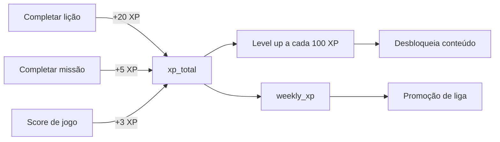
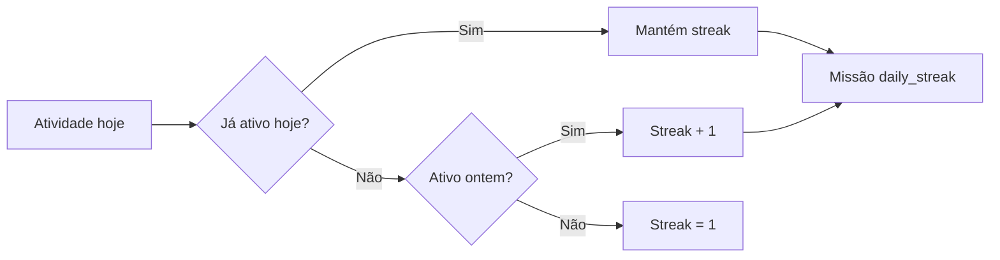

# Gamificação

## Visão geral

SATQUEST usa um sistema de gamificação inspirado em Duolingo, Pokemon GO,
CodeWars e Steam Achievements. O objetivo é maximizar engajamento, aprendizagem
e retenção.

## Sistema de XP



### Cálculo de nível

```
level = floor((xp_total / 100) + 1)
```

XP para o próximo nível: `xp_total % 100` de `100`.

### Fontes de XP

| Ação | XP |
|------|----|
| Completar lição | 20 |
| Resgatar missão | 5 |
| Score de jogo | 3 |

> Nota: Lições, jogos e missões recompensam apenas XP (não satoshis). A
> carteira Bitcoin é separada e funciona para envio/recebimento real.

## Ligas

Competição semanal baseada em `weekly_xp`:

| Liga | XP mínimo/semana | Emoji | Cor |
|------|------------------|-------|-----|
| Bronze | 0 | 🥉 | #CD7F32 |
| Prata | 500 | 🥈 | #C0C0C0 |
| Ouro | 1000 | 🥇 | #FFD700 |
| Platina | 2000 | 💠 | #E8E8E8 |
| Diamante | 3500 | 💎 | #B9F2FF |
| Mestre | 6000 | 🏆 | #FF6B35 |
| Lenda | 10000 | 👑 | #FFD700 |

A liga é armazenada em `profiles.league` e atualizada semanalmente.

## Streak (sequência)



- Armazenado em `profiles.streak_days`
- Atualizado automaticamente pela função `complete_lesson`
- Missão `daily_streak` ativa quando streak ≥ 2

### Congelamento de streak

A tabela `streak_freezes` permite que o usuário congele a sequência por um dia
sem perder o streak (mecânica futura, dados já estruturados).

## Badges

35+ conquistas disponíveis, divididas em categorias:

### Primeiros passos
- `first_login` — Primeiro Login 👋
- `first_lesson` — Primeira Lição 📖
- `first_sats` — Primeiros Satoshis 🪙
- `first_hash` — Primeiro Hash 🔐
- `first_wallet` — Primeira Carteira 👛
- `first_code` — Primeiro Código ⌨️
- `first_commit` — Primeiro Commit 💻

### XP
- `100_xp` — 100 XP ⭐
- `500_xp` — 500 XP 🌟
- `1000_xp` — 1000 XP 💫
- `5000_xp` — 5000 XP ✨

### Sequência
- `30_days` — 30 Dias 🔥
- `100_days` — 100 Dias 🔥🔥
- `perfect_week` — Semana Perfeita 📅

### Ligas
- `league_silver` — Liga Prata 🥈
- `league_gold` — Liga Ouro 🥇
- `league_platinum` — Liga Platina 💠
- `league_diamond` — Liga Diamante 💎
- `league_master` — Liga Mestre 🏆
- `league_legend` — Lenda 👑

### Mineração
- `miner_bronze` — Mineiro Bronze ⛏️
- `miner_silver` — Mineiro Prata 🪨
- `miner_gold` — Mineiro Ouro 💎

### Segurança
- `security_expert` — Especialista em Segurança 🛡️
- `phishing_hunter` — Caçador de Phishing 🎣

### Social
- `first_friend` — Primeiro Amigo 🤝
- `social_10` — Sociável 👥
- `social_50` — Popular 🌟

### Especiais
- `speed_demon` — Velocista ⚡
- `explorer` — Explorador 🗺️
- `boss_slayer` — Caçador de Chefes ⚔️
- `lightning_router` — Roteador Lightning ⚡
- `blockchain_builder` — Construtor de Blockchain 🔗
- `seed_master` — Mestre das Seeds 🌱

Badges são concedidos automaticamente pela função `complete_lesson` e
armazenados em `user_badges`.

## Missões diárias

| Missão | Objetivo | Recompensa |
|--------|----------|------------|
| `daily_lesson` | Completar 1 lição | 5 XP |
| `daily_quiz_perfect` | Acertar 100% do quiz | 5 XP |
| `daily_streak` | Manter streak (≥ 2 dias) | 5 XP |

As missões resetam diariamente (`period_date = current_date`).

## Sistema de amigos

- Cada usuário recebe um código único (`SAT-XXXXXX`) ao se cadastrar
- Envio de solicitação via `send_friend_request(friend_code)`
- Aceitação/rejeição via `accept_friend_request` / `reject_friend_request`
- Amizade é bidirecional (duas entradas na tabela `friends`)
- Ranking semanal comparando XP entre amigos

## Desafios

20 tipos de desafios disponíveis em `challenge_types`:

| Categoria | Exemplos |
|----------|----------|
| Criptografia | Hash puzzle, Proof of Work |
| Blockchain | Block builder, Block validate, Invalid block |
| Lightning | Lightning connect |
| Programação | Code complete, Code logic |
| Segurança | Phishing detect, Scam detect, Multi-sig |
| Economia | Mining sim, Economy sim, Halving predict |
| Wallet | Seed assembly, Wallet setup |
| Mempool | TX order, Fee calc |
| Consenso | PoW puzzle, Block validate |
| Redes | Network routing |
| Internet | Internet basics |

Cada desafio tem dificuldade de 1 a 5 estrelas. O progresso é armazenado em
`user_challenges`.
