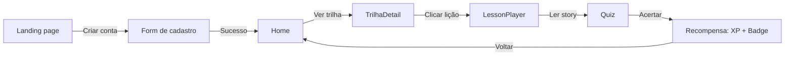
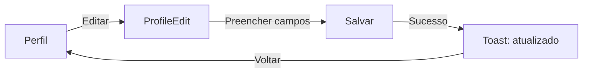
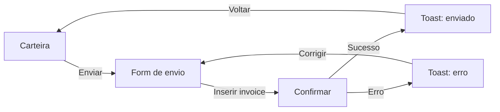

# UX — Experiência do Usuário

## Princípios

### 1. Aprendizagem sem fricção

O aluno nunca deve se sentir perdido. Cada tela tem:

- Um objetivo claro (título + subtítulo)
- Uma ação primária visível (botão principal)
- Feedback imediato (toast, animação, mudança de estado)

### 2. Progressão visível

O aluno sempre sabe onde está e o que falta:

- Barra de XP no topo da Home
- Progresso da trilha (X/Y lições)
- Streak visível no header
- Liga atual no perfil

### 3. Recompensa constante

O aluno recebe feedback positivo frequentemente:

- XP a cada lição completada
- Badge ao atingir marcos
- Missão completada com animação
- Mascote reagindo ao progresso

### 4. Segurança psicológica

Errar não é punido:

- Quiz errado: tenta de novo, sem penalidade
- Desafio falhado: pode refazer
- Não há timer estressante (exceto jogos opcionais)

## Fluxos principais

### Onboarding → Cadastro → Primeira lição

### Perfil → Editar → Salvar

### Carteira → Enviar → Confirmar

## Microinterações

| Elemento | Interação | Feedback |
|----------|-----------|----------|
| Botão | Tap | `whileTap: { scale: 0.97 }` |
| Card | Hover | Background muda |
| Link | Hover | Borda fica mais forte |
| Input | Focus | Borda fica laranja |
| Toast | Aparece | Slide down + fade |
| XP bar | Atualiza | Animação de progresso |
| Mascote | Estado | Expressão muda (feliz, curioso) |

## Estados

### Loading

- Skeletons para conteúdo que carrega
- Spinner no botão durante submit
- Splash screen durante auth check

### Erro

- Toast vermelho com mensagem clara
- Botão "Tentar de novo" quando aplicável
- Estado de erro na tela (EmptyState)

### Vazio

- EmptyState com mascote
- Texto explicativo
- CTA para ação primária

## Acessibilidade (UX)

- Contraste mínimo 4.5:1
- Área de toque mínimo 44px
- Foco visível
- Texto sempre legível (sem texto sobre imagem sem overlay)
