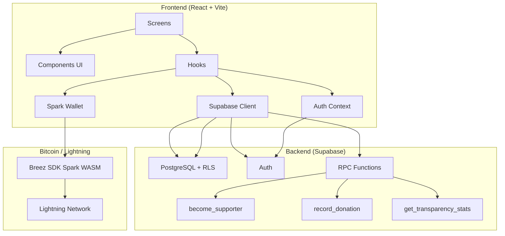

<div align="center">

# BIT NO CORRE

### Aprender hoje. Transformar amanhã. Retribuir para sempre.

[](https://opensource.org/licenses/MIT)
[](https://www.typescriptlang.org/)
[](https://react.dev/)
[](https://supabase.com/)
[](https://lightning.network/)
[](https://hack4freedom.com)

**Plataforma de transformação social que usa Bitcoin e educação para criar um ciclo infinito de impacto.**

[O Problema](#o-problema) · [Nossa Solução](#nossa-solução) · [Como Funciona](#como-funciona) · [Por que Bitcoin](#por-que-bitcoin) · [Impacto](#impacto) · [Roadmap](#roadmap)

</div>

---
## Visão Geral

Bit no Corre é uma plataforma que conecta apoiadores da causa diretamente aos jovems em estado de vulnerabilidade.
O objetivo é criar oportunidades transparentes e sem fronteiras para para jovems iniciarem sua vida financeira com mais estabilidade e segurança.


## O Problema

> No Brasil, **mais de 2 milhões** de crianças e adolescentes vivem em situação de vulnerabilidade social. A maioria não tem acesso a educação de qualidade, muito menos a tecnologia. Sem oportunidade, o ciclo de pobreza se repede — e a desigualdade cresce.

Não é apenas falta de dinheiro. É falta de **esperança**, de **oportunidade** e de **autonomia**.

## Nossa Solução

**BIT NO CORRE** não é apenas uma plataforma de educação. É uma **plataforma de transformação social**.

Conectamos jovens em situação de vulnerabilidade com pessoas que desejam apoiar sua educação, desenvolvimento e autonomia. O jovem apoiado hoje aprende, desenvolve habilidades e retorna como apoiador de outra criança — criando uma **corrente infinita de impacto**.

### O ciclo de transformação

```
Pessoa apoia → Jovem recebe acesso → Aprende → Desenvolve habilidades
    → Conquista autonomia → Retorna como apoiador → (ciclo repete)
```

### Quem beneficiamos

- Crianças em abrigos
- Adolescentes em acolhimento institucional
- Jovens em situação de vulnerabilidade
- Estudantes de escolas públicas
- Jovens em risco social

## Como Funciona

1. **Apoiadores** fazem microdoações via Bitcoin/Lightning (qualquer valor, a partir de 100 satoshis)
2. **Jovens** recebem acesso gratuito à plataforma de educação
3. **Aprendem** Bitcoin, programação, criptografia, segurança digital e economia
4. **Desenvolvem** habilidades práticas e autonomia financeira
5. **Retornam** como apoiadores de outros jovens, fechando o ciclo

## Por que Bitcoin

Bitcoin não é o protagonista. É uma **ferramenta** para democratizar acesso à educação:

| Vantagem | Benefício |
|----------|-----------|
| **Microdoações** | Qualquer pessoa pode apoiar com qualquer valor |
| **Transparência** | Cada satoshi é rastreável na blockchain |
| **Baixo custo** | Lightning Network: taxas quase zero |
| **Sem fronteiras** | Funciona para qualquer pessoa, em qualquer lugar |
| **Inclusão financeira** | Acesso a dinheiro digital sem banco |

## Impacto

### ODS da ONU relacionados

| ODS | Como contribuímos |
|-----|-------------------|
| **ODS 1** — Erradicação da pobreza | Educação como caminho para autonomia financeira |
| **ODS 4** — Educação de qualidade | Acesso gratuito a educação tecnológica |
| **ODS 8** — Trabalho decente | Habilidades para o mercado de tecnologia |
| **ODS 10** — Redução de desigualdades | Democratização do conhecimento |
| **ODS 17** — Parcerias | Conecta ONGs, escolas, empresas e apoiadores |

### Métricas (em tempo real)

- Satoshi arrecadados
- Número de apoiadores
- Jovens impactados
- Horas de estudo patrocinadas
- Projetos financiados

## Funcionalidades

| Categoria | O que faz |
|-----------|-----------|
| **Abraça a Causa** | Página dedicada à missão social, com transparência, histórias e doação |
| **Trilhas de aprendizado** | Lições estruturadas de Bitcoin, programação e segurança |
| **Missões diárias** | Tarefas que mantêm o engajamento |
| **Sistema de XP e níveis** | Progressão visível |
| **Ligas** | Competição semanal (Bronze → Lenda) |
| **Badges** | 40+ conquistas para desbloquear |
| **Sistema de amigos** | Adicione amigos, veja ranking, compare progresso |
| **Carteira Bitcoin** | Carteira real via Breez SDK Spark (Lightning) |
| **Perfil público** | Username, bio, links, QR Code, compartilhamento social |
| **Painel de transparência** | Métricas em tempo real de arrecadação e impacto |
| **Parceiros verificados** | ONGs, escolas, abrigos, empresas com selo de verificação |
| **Mural da comunidade** | Mensagens de apoio e gratidão |
| **Histórias de transformação** | Depoimentos reais (anonimizados) dos beneficiários |

## Tecnologias

| Camada | Tecnologia |
|--------|-----------|
| **Frontend** | React 19, TypeScript, Vite 6, Framer Motion |
| **Backend** | Supabase (PostgreSQL, Auth, RLS, Edge Functions) |
| **Bitcoin** | Breez SDK Spark (Lightning Network, non-custodial) |
| **Design** | CSS custom properties, paleta acolhedora e esperançosa |

## Arquitetura



## Como executar

```bash
git clone https://github.com/jamielly/bit-no-corre.git
cd bit-no-corre
npm install
npm run dev
```

## Documentação

Documentação completa em [`/docs`](./docs): arquitetura, banco de dados, API, autenticação, gamificação, segurança, deploy, roadmap e mais.

## Roadmap

| Versão | Funcionalidade | Status |
|--------|---------------|--------|
| v0.3 | Plataforma base + Abraça a Causa + doações | ✅ |
| v0.4 | Sistema de amigos completo | ✅ |
| v0.5 | Recuperação de senha + compartilhamento social | ✅ |
| v0.6 | Painel para professores e ONGs | 📋 |
| v0.7 | Integração com ZBD para recompensas reais | 📋 |
| v1.0 | Lançamento para 100 escolas públicas | 📋 |

## Autores

<table>
<tr>
<td align="center">
<br />
<strong>Jamielly Reis</strong><br />
Escola 42 São Paulo
</td>
<td align="center">
<br />
<strong>Amanda Moura</strong><br />
Escola 42 São Paulo
</td>
</tr>
</table>

## Licença

Distribuído sob a licença MIT. Veja [LICENSE](./LICENSE).

---

<div align="center">

**Desenvolvido para o Hack4Freedom 2026 — São Paulo**

"Toda criança merece uma oportunidade. Toda oportunidade pode mudar uma vida."

</div>

